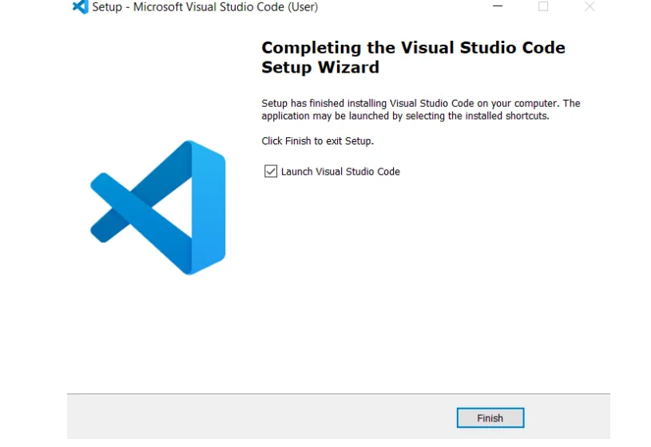
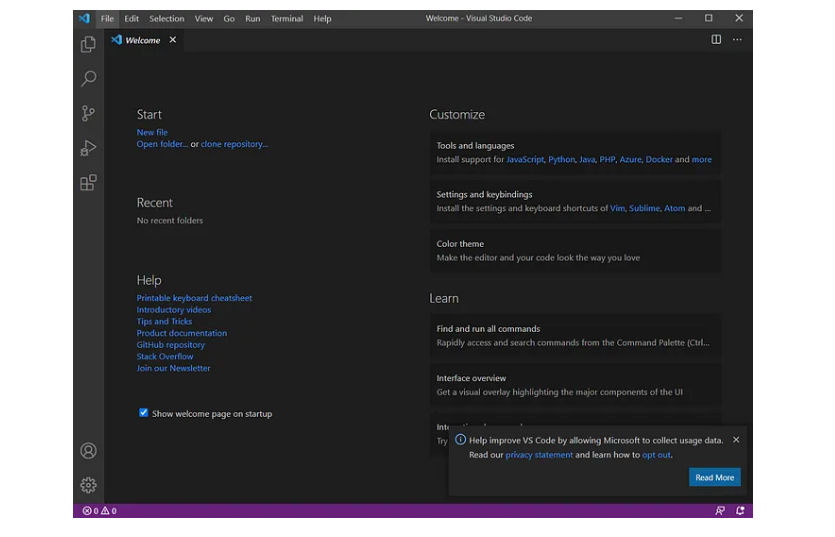
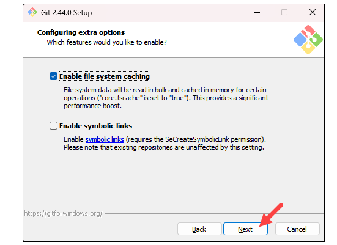
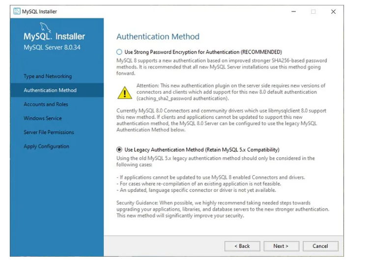

# Dev_Setup
Setup Development Environment

#Assignment: Setting Up Your Developer Environment

#Objective:
This assignment aims to familiarize you with the tools and configurations necessary to set up an efficient developer environment for software engineering projects. Completing this assignment will give you the skills required to set up a robust and productive workspace conducive to coding, debugging, version control, and collaboration.

#Tasks:

1. Select Your Operating System (OS):
   Choose an operating system that best suits your preferences and project requirements. Download and Install Windows 11. https://www.microsoft.com/software-download/windows11

Windows 11 is my Operating System. 

To install Windows 11 on your computer, follow these steps:

1. **Check System Requirements**
Ensure your computer meets the minimum requirements for Windows 11:Compatible 64-bit processor with at least 1 GHz clock speed and 2 or more cores.4 GB RAM or more.64 GB storage or larger SSD.UEFI firmware with Secure Boot capability.PM version 2.0.DirectX 12 compatible graphics / WDDM 2.x.High definition (720p) display that is greater than 9” diagonally, 8 bits per color channel.

2.**Backup Your Data**
Before proceeding, it's essential to back up all your important files and data to an external drive or cloud storage.

3. **Prepare Installation Media**
You will need a USB flash drive with at least 8 GB of storage capacity. Follow these steps to create a bootable USB drive:Download the Windows 11 Installation Media Creation Tool from the official Microsoft website.Run the tool and follow the on-screen instructions to create a bootable USB drive. This process will also download the necessary Windows 11 installation files.

4. **Access BIOS/UEFI Settings**
Restart your computer and access the BIOS/UEFI settings by pressing a specific key (like F2, F10, Esc, or Delete) during the startup process. The key depends on your computer's manufacturer.Inside the BIOS/UEFI settings, ensure the following:UEFI firmware with Secure Boot is enabled.TPM (Trusted Platform Module) is enabled and set to version 2.0.Boot mode is set to UEFI.

5. **Install Windows 11**
Insert the bootable USB drive into your computer.Restart your computer. It should boot from the USB drive automatically. If not, you might need to change the boot order in BIOS/UEFI settings to prioritize the USB drive.Follow the on-screen instructions to install Windows 11. You'll be prompted to choose language, time, and keyboard preferences.When prompted, select the installation type (usually "Custom: Install Windows only (advanced)").Choose the partition where you want to install Windows 11. If needed, you can create or delete partitions here.Follow the remaining prompts to complete the installation process. Your computer may restart several times.

6. **Once Windows 11 is installed**, follow the on-screen instructions to personalize your settings, connect to a network, and sign in with your Microsoft account.

7. Install Drivers and Updates After setup, it's essential to install drivers for your hardware components (like graphics, audio, network, etc.). You can usually find these on your computer manufacturer's website.
Install Windows updates to ensure your system is up to date with the latest security patches and features.

8.  **Restore Your Data**Transfer your backed-up files and data back to your computer.

2. Install a Text Editor or Integrated Development Environment (IDE):
   Select and install a text editor or IDE suitable for your programming languages and workflow. Download and Install Visual Studio Code. https://code.visualstudio.com/Download

Steps in installing VS Code on Windows 11

3. Set Up Version Control System:
   Install Git and configure it on your local machine. Create a GitHub account for hosting your repositories. Initialize a Git repository for your project and make your first commit. https://github.com

**Installing Git and configure it on my local machine**

**This is how I created a GitHub account:**

1. Visit GitHub WebsiteOpen your web browser and go to GitHub.

2. Sign UpOn the GitHub homepage, you'll see a "Sign up" section. Enter the following information:
Username: Choose a unique username for your GitHub account. If your preferred username is not available, GitHub will suggest alternatives.Email address: Use your valid email address. This will be used for account verification and notifications.Password: Choose a strong password.Alternatively, you can sign up using your existing Google account by clicking on "Sign up with Google".

3. Verify Your Email AddressAfter entering your details, GitHub will send a verification email to the email address you provided.Check your email inbox and click on the verification link from GitHub to verify your email address.

4. Complete the Sign-Up ProcessOnce your email is verified, you'll be redirected to GitHub.
Complete any additional steps prompted by GitHub, such as setting up a profile picture or providing more information.

5. Explore GitHubNow that your account is created, you can explore GitHub and start using its features, such as creating repositories, contributing to projects, and collaborating with others.

6. Optional: Set Up Two-Factor Authentication (2FA)For added security, consider setting up Two-Factor Authentication (2FA) for your GitHub account. You can do this by going to your account settings and following the instructions under the "Security" tab.

7. Start Using GitHub You can now create repositories to host your code, collaborate with others on projects, and explore the vast community of developers on GitHub.

**hosting your repositories. Initialize a Git repository for your project and make your first commit. https://github.com**

4. Install Necessary Programming Languages and Runtimes:
  Instal Python from http://wwww.python.org programming language required for your project and install their respective compilers, interpreters, or runtimes. Ensure you have the necessary tools to build and execute your code.

**Istalling python Programming language and necessary tools.**

5. Install Package Managers:
   If applicable, install package managers like pip (Python).

6. Configure a Database (MySQL):
   Download and install MySQL database. https://dev.mysql.com/downloads/windows/installer/5.7.html

7. Set Up Development Environments and Virtualization (Optional):
   Consider using virtualization tools like Docker or virtual machines to isolate project dependencies and ensure consistent environments across different machines.

8. Explore Extensions and Plugins:
   Explore available extensions, plugins, and add-ons for your chosen text editor or IDE to enhance functionality, such as syntax highlighting, linting, code formatting, and version control integration.

1. **Visual Studio Code (VS Code)**
*Extensions:*
*ESLint: Provides JavaScript linting (code quality analysis) to catch errors and enforce coding standards.
Prettier - Code formatter: Automatically formats code for various languages (JavaScript, TypeScript, HTML, CSS, etc.).
*GitLens*: Supercharges the Git capabilities built into VS Code, providing powerful features like line-by-line blame annotations, repository/file history, and more.
Bracket Pair Colorizer: Colors matching brackets in your code for better readability.
Live Server: Launches a local development server with live reload capability for HTML, CSS, and JavaScript files.Remote - SSH: Allows you to edit files on a remote machine over SSH directly from VS Code.

2. **Sublime Text Packages**
SublimeLinter: Framework for linting code.
HTML-CSS-JS Prettify: Formats and prettifies HTML, CSS, JavaScript, and JSON code.
Git: Provides Git integration within Sublime Text.
BracketHighlighter: Highlights matching brackets to improve code navigation.

3. **Atom Packages:**
linter: Base linter package that provides interface to integrate with various linters (e.g., ESLint, JSHint).
prettier-atom: Atom package for the Prettier code formatter.
git-plus: Git integration with Atom.
highlight-selected: Highlights occurrences of the selected word in the editor.

4. **JetBrains IntelliJ IDEA** (for Java, Kotlin, etc.)Plugins:
Code Inspection: Built-in static code analysis to highlight errors and potential problems.
Version Control: Integrated Git support.
Markdown Support: Provides syntax highlighting and preview for Markdown files.

5. **Eclipse Plugins:**
Eclim: Integrates Eclipse with Vim, allowing Vim as an editor within Eclipse.
EGit: Eclipse Git Team Provider for version control.
Code Recommenders: Intelligent code completion based on usage patterns.

**General Recommendations:**
Code Quality and Linting: Use linters like ESLint (for JavaScript) or style checkers specific to your programming language to maintain code quality and enforce standards.
Version Control Integration: Ensure your IDE or editor has robust Git integration or plugins for seamless version control operations.
Syntax Highlighting and Formatting: Look for extensions that enhance syntax highlighting and support for various file formats you commonly work with.
Remote Development: Extensions or plugins that support remote development can be invaluable for working on code hosted on servers or VMs.

9. Document Your Setup:
    Create a comprehensive document outlining the steps you've taken to set up your developer environment. Include any configurations, customizations, or troubleshooting steps encountered during the process. 

Below are configrations,customizations and troubleshooting that I encounted during the process

#Deliverables:
- Document detailing the setup process with step-by-step instructions and screenshots where necessary.
- A GitHub repository containing a sample project initialized with Git and any necessary configuration files (e.g., .gitignore).
- A reflection on the challenges faced during setup and strategies employed to overcome them.

#Submission:
Submit your document and GitHub repository link through the designated platform or email to the instructor by the specified deadline.

#Evaluation Criteria:**
- Completeness and accuracy of setup documentation.
- Effectiveness of version control implementation.
- Appropriateness of tools selected for the project requirements.
- Clarity of reflection on challenges and solutions encountered.
- Adherence to submission guidelines and deadlines.

Note: Feel free to reach out for clarification or assistance with any aspect of the assignment.
